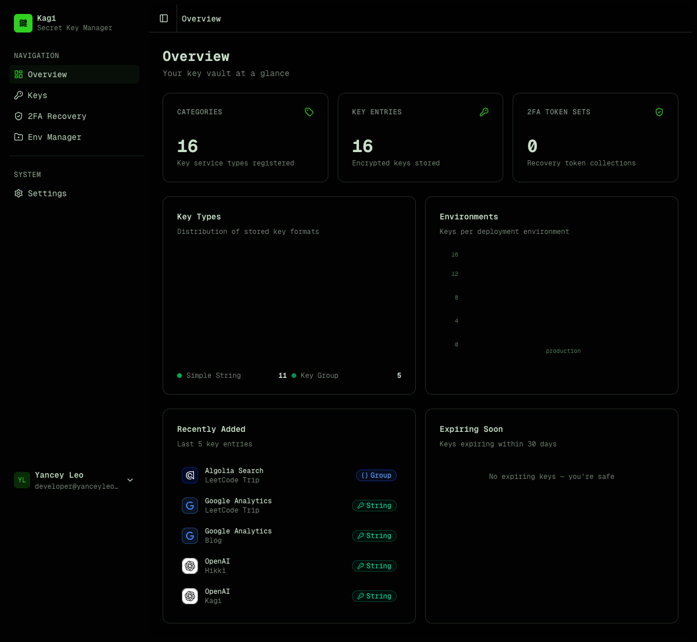
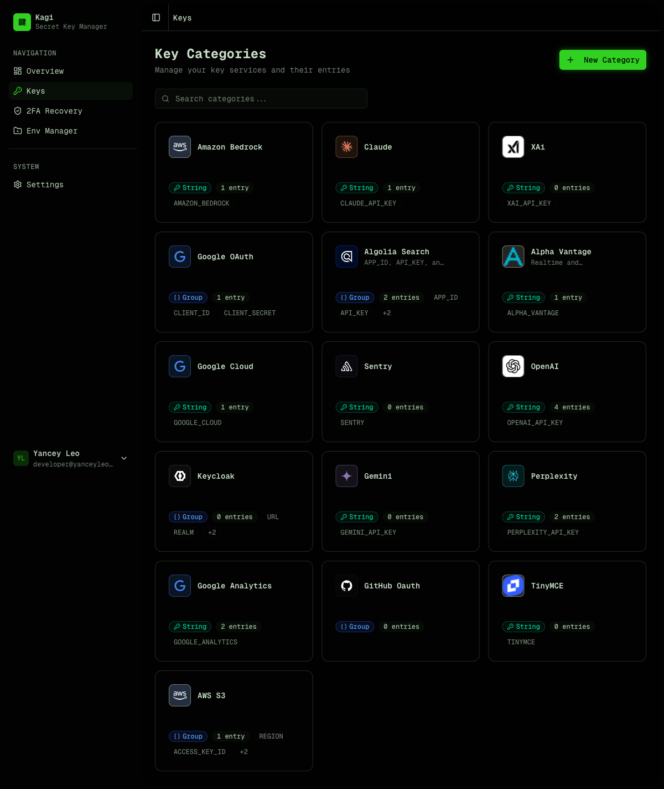
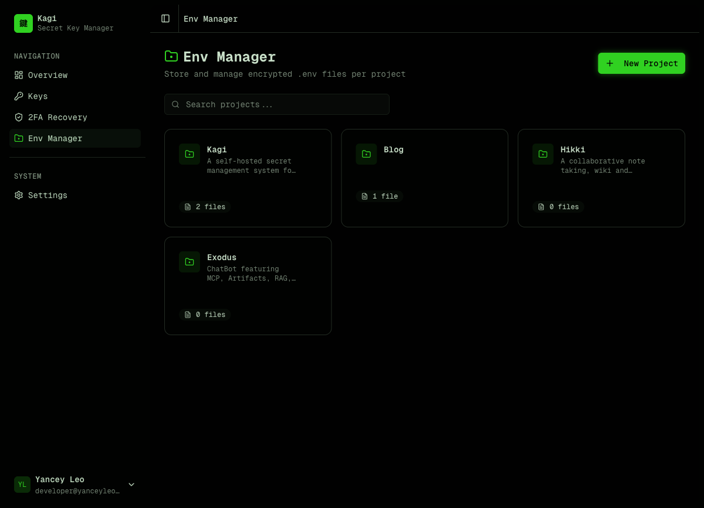
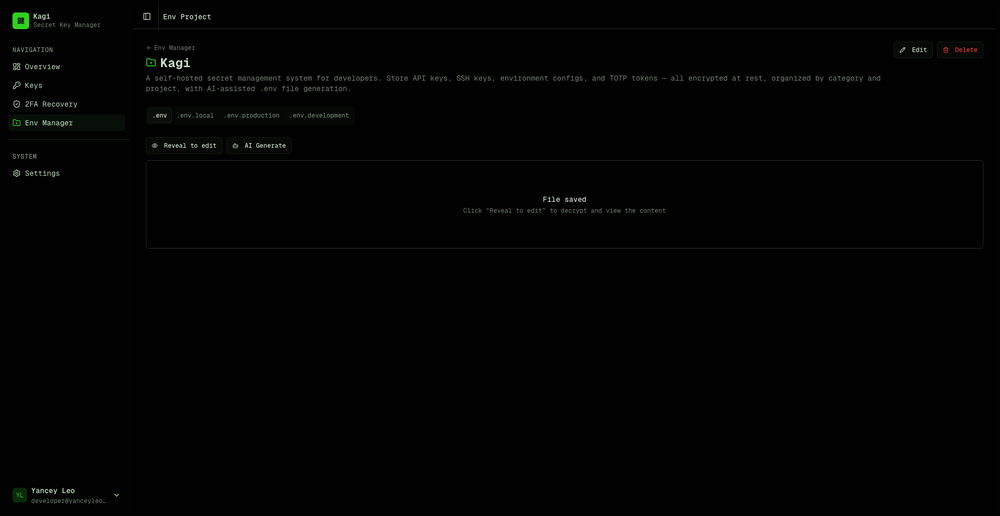
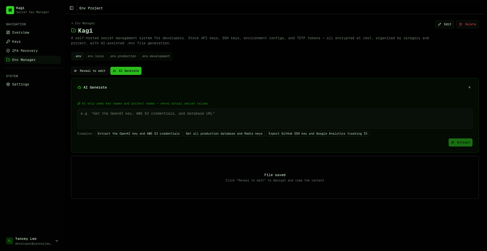
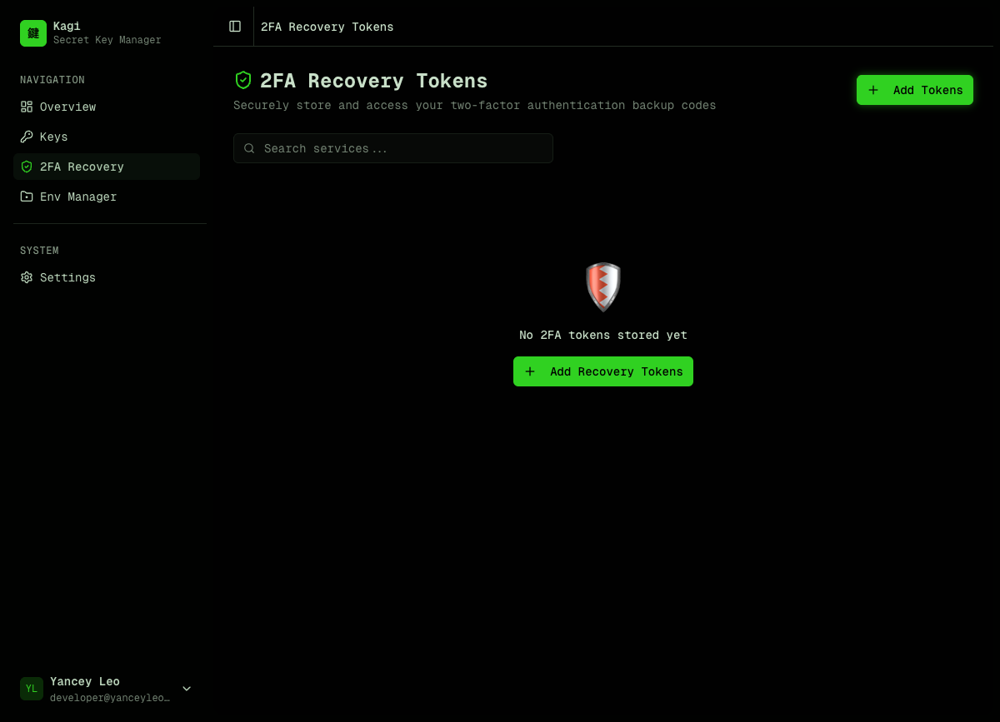
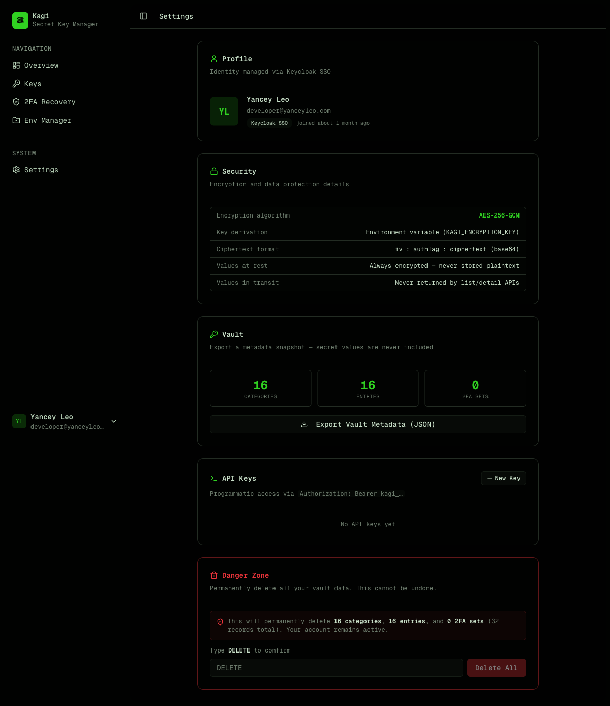

Kagi is a **self-hosted encrypted secret management system** for developers. Think of it as a private vault for your API keys, environment configs, `.env` files, and 2FA recovery tokens.

## Dashboard

The dashboard gives you an at-a-glance overview of your vault — total categories, entries, and 2FA token sets, plus charts showing key type distribution and environment breakdown.



## Key management

Kagi organizes secrets in two levels:

1. **Category** — defines the _type_ and _format_ of a key (e.g. "OpenAI API", "AWS Credentials"). Think of it as a key template.
2. **Entry** — a per-project instance of a category (e.g. "OpenAI API for Blog Project"). Stores the encrypted value.

This lets you reuse the same category definition (with its env var name, icon, and field layout) across multiple projects.



### Key types

| Type     | Description                     | Stored as             |
| -------- | ------------------------------- | --------------------- |
| `simple` | Single environment variable     | Encrypted string      |
| `group`  | Multi-field map (e.g. AWS keys) | Encrypted JSON object |

## Env file manager

Store encrypted `.env`, `.env.local`, `.env.production`, and `.env.development` files organized by project. Each file is encrypted at rest and can only be revealed through an explicit action.



Each project has tabs for different file types. Click "Reveal to edit" to decrypt and modify content, or use "AI Generate" to automatically assemble a `.env` file from your stored keys.



## AI-powered .env generation

Click "AI Generate" in any env project, describe what you need in plain English, and Kagi assembles a ready-to-paste `.env` file from your vault.



### Privacy-first design

The AI **never sees your actual secret values**. Here's how it works:

1. Kagi sends only **key names, project names, and env var names** to the AI model (GPT-4o-mini)
2. The AI analyzes your prompt and returns a list of **entry IDs** it thinks you need
3. The server **validates** those IDs against your actual entries (prevents injection)
4. Decryption happens **entirely server-side** — the AI is never in the loop for secret values
5. The assembled `.env` file is returned to your browser

```
Your prompt → AI sees: [category names, project names, env var names]
           → AI returns: [entry IDs]
           → Server decrypts selected entries
           → .env file assembled and returned
```

### Smart context awareness

- **Framework detection** — mention "Next.js" and the AI automatically applies `NEXT_PUBLIC_` prefixes where appropriate. For Electron, React Native, or plain Node.js it uses the raw env var names as defined.
- **Project scoping** — if you're inside a project (e.g. "Kagi"), saying "this project" or "current project" automatically scopes to entries matching that project name.
- **Multi-field groups** — for `group` type keys (e.g. AWS with `ACCESS_KEY_ID`, `SECRET_ACCESS_KEY`, `REGION`), all fields are expanded into separate env vars.
- **Secret generation** — ask for "a session secret" or "random JWT key" and the AI generates cryptographically secure random values (hex, base64, base64url, or alphanumeric) without touching the vault. All generated env var names are normalized to `SCREAMING_SNAKE_CASE`.
- **Bilingual prompts** — works with both English and Chinese prompts (e.g. "获取 OpenAI 密钥" or "给我生成一个随机密钥").

## 2FA recovery tokens

Securely store two-factor authentication backup codes. Tokens are encrypted and can be revealed one at a time with usage tracking.



## Settings

Manage your profile, view encryption details, export vault metadata, create API keys for programmatic access, and manage your account.



## Encryption model

All secret values are encrypted with **AES-256-GCM** before being written to the database:

- The master key comes from the `KAGI_ENCRYPTION_KEY` environment variable (64 hex chars = 32 bytes)
- Ciphertext format: `iv:authTag:ciphertext` (all base64, colon-separated)
- The master key is never stored in the database

**Values are never returned by list or detail API endpoints.** You must call the dedicated `/reveal` endpoints explicitly to decrypt a value.

## Authentication

Kagi supports two authentication methods:

- **Email / password** — simple built-in auth, no external dependencies
- **Keycloak SSO** — delegate authentication to your existing Keycloak instance
- **Access keys** — static API tokens for programmatic access (CI/CD, scripts, integrations)

Access keys use the format `kagi_<43-char-base64url>` and are passed as `Authorization: Bearer kagi_<token>`.

## What Kagi is not

- Not a secrets manager with runtime injection (like Vault or Doppler)
- Not a password manager for end users
- Not a credential rotation service

Kagi is a **developer tool** for storing and retrieving secrets programmatically, with a clean REST API and strong encryption guarantees.
